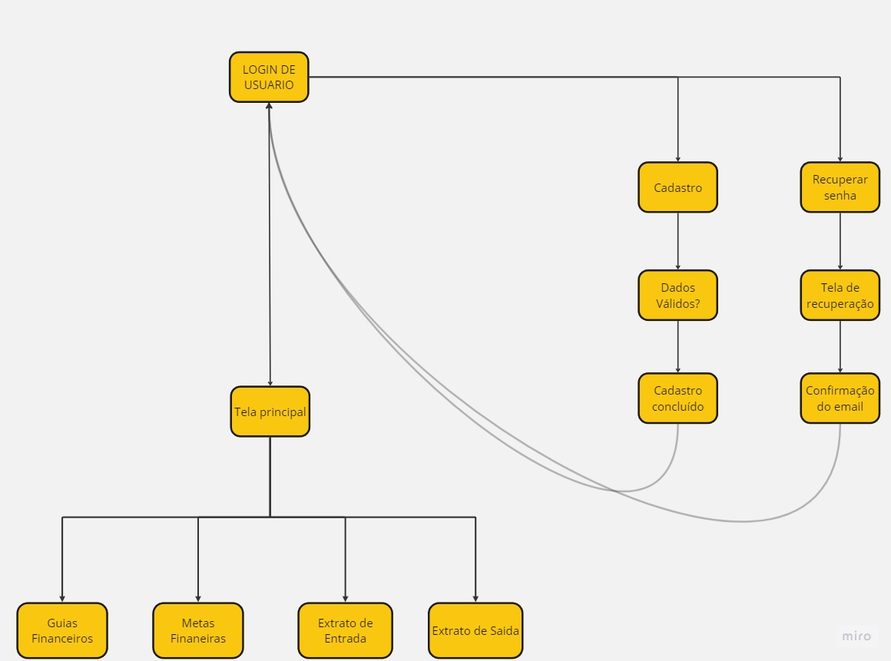

# Projeto de Interface

## User Flow

O user flow apresentado na figura 1 mostra o fluxo de interação do usuário pelas telas do sistema. Cada uma das telas deste fluxo é detalhada na seção Protótipo que se segue. Para visualizar o user flow de forma interativa, basta [acessar este link](https://www.figma.com/proto/aWJlTrrAD3CDfvoTD1Nd9U/Guia-Financeiro?page-id=456%3A335&node-id=2814-149&scaling=scale-down&starting-point-node-id=2814%3A149&mode=design&t=G0CkIJD7Zlrvs97R-1).

## Protótipo

Desenvolver um protótipo emerge como uma das maneiras mais ágeis e econômicas de validar uma ideia, conceito ou funcionalidade. Isso permite a interação, avaliação, modificação e aprovação das principais características de uma interface antes de entrar na fase de desenvolvimento.

Um protótipo de alta fidelidade se aproxima ao máximo dos aspectos visuais e funcionais do produto final, incluindo o conteúdo, fluxo de navegação e interações. São muito utilizados para testes e validação com usuários, ou para vender uma ideia, pois ver o produto “funcionando” costuma gerar fascinação.

Na próxima seção é apresentado o protótipo de alta fidelidade da aplicação.

### Protótipo de alta fidelidade

O protótipo de alta fidelidade do sistema foi desenvolvido e disponibilizado através da ferramenta [Figma](https://www.figma.com/) e se encontra acessível [neste link](https://www.figma.com/file/aWJlTrrAD3CDfvoTD1Nd9U/Guia-Financeiro?type=design&node-id=2832%3A535&mode=dev)
